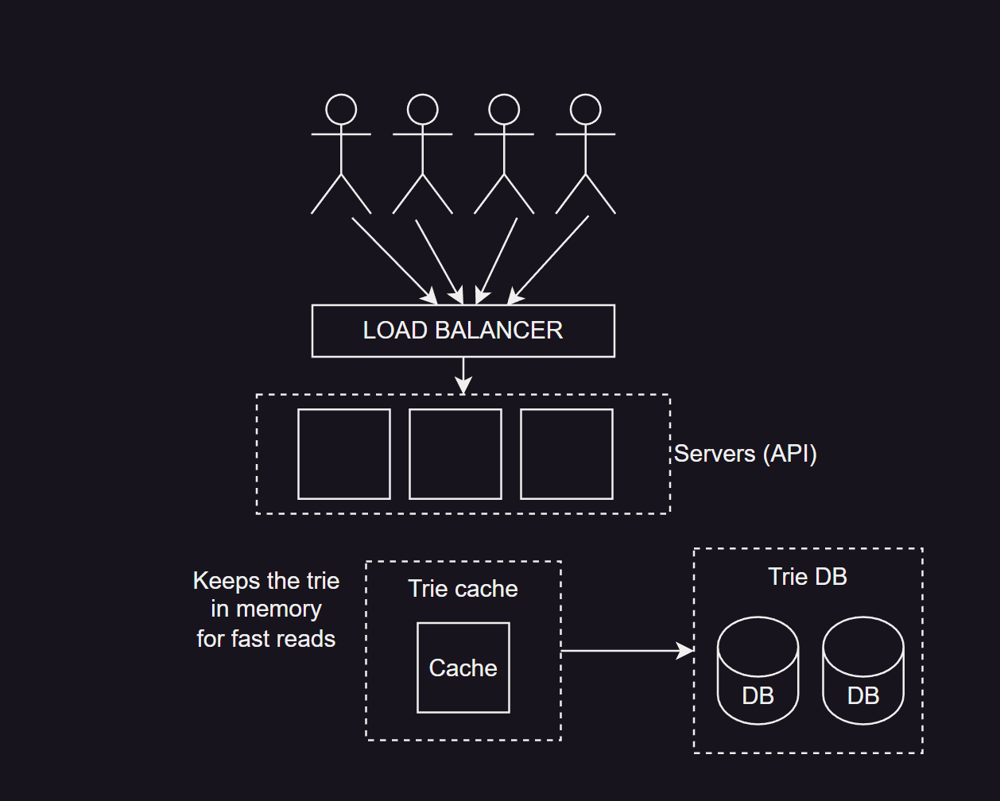

# Search Autocomplete system

## Requirements:

- [x] <u>5</u> autocomplete suggestions
- [ ] Suggestions should be ranked by <u>popularity</u>
- [x] <u>No spell checking</u> - out of scope
- [x] <u>English only</u> - multi-language out of scope
- [x] <u>5 million</u> daily users
- [x] Highly <u>available</u> & <u>low</u> latency

## Scale Estimation

5M users, average 10 searches per day

- 1 character = 1 byte (ASCII encoding)
- Assumption:
  - 1 query -> 4 words
  - 1 word -> 6 characters

=> 4 x 6 x 1 byte = 24 bytes / query

=> 10 searches x 24 bytes = 240 bytes / user / day

=> (240 bytes x 5,000,000 users) / 24h / 3600s

=> 13888 queries per second

=~ <u>14000</u> OPS on average

| Note: for each char in the word "Hello", we send 1 autocomplete request

We can assume double for peak:

=~ <u>28000</u> OPS peak

## Design:

- 2 Sub-systems
  - 1 - Query Service: returns the 5 most frequently searched terms for a given query.
  - 2 - Search Frequency Storage Service: counts, aggregates and store search terms and how frequently they are searched for.

### Query Service

#### Storage Solution:

Trie database + Cache

- Trie is a tree data structure
- each node stores the string, and the associated frequency if it's a searched term
- All parent nodes have a cache associated to them with the top K most searched terms (K=5 in our case)
- Time complexity:
  - t = search term length
  - c = no. children of a given node

Pre-cache: O(t) + O(c) + O(c log c)
With cache: O(t) if t is limited => O(1)

### Search Frequency Storage Service

Real time frequency counts & updates are not scalable. A better way is to batch & update

#### Logs:

| search_term | timestamp           |
|-------------|---------------------|
| ted         | 2023-01-01 10:20:09 |
| tea         | 2023-01-02 11:34:52 |
| ted         | 2023-01-03 02:05:12 |
| win         | 2023-01-03 13:12:05 |
| tea         | 2023-01-04 05:19:45 |

#### Aggregated data:

| search_term | timestamp   | frequency |
|-------------|-------------|-----------|
| ted         | 2023-01-01  | 2         |
| tea         | 2023-01-02  | 2         |
| win         | 2023-01-03  | 1         |
